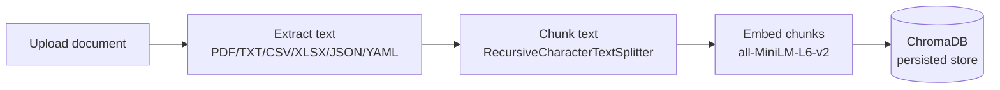

# GenAI Doc Assistant

An AI agent-based knowledge and decision support system. Upload enterprise documents
(PDF, TXT, CSV, Excel, JSON, YAML), ask natural-language questions, and get grounded
answers produced by a multi-agent RAG pipeline built on FastAPI, ChromaDB, and Groq.

Capstone project for Generative AI and ML (Illinois Tech / Edureka).

---

## Architecture

### Ingestion flow



### Question-answering flow (multi-agent pipeline)

```mermaid
flowchart LR
    Q[User question] --> P[PlannerAgent\ndecides sub-queries + top_k]
    P --> R[RetrieverAgent\nvector similarity search]
    R --> RE[ReasonerAgent\nextracts grounded facts]
    RE --> RS[ResponderAgent\nwrites final answer]
    RS --> V[VerifierAgent\nchecks answer vs context]
    V -->|grounded| OUT[Final answer + sources]
    V -->|not grounded| REFUSAL[\"I don't know\" refusal]
```

A simpler single-shot RAG path (`/ask-question`) also exists alongside the agent
pipeline (`/ask-agent`) for comparison - see **Endpoints** below.

---

## Agent roles

| Agent | Responsibility |
|---|---|
| **PlannerAgent** | Breaks the question into one or more focused sub-queries, decides how many chunks to retrieve (`top_k`), and skips retrieval entirely for non-document questions (e.g. greetings). |
| **RetrieverAgent** | Runs each sub-query against ChromaDB, dedupes results, filters out low-relevance matches by distance score, and returns a ranked chunk list. |
| **ReasonerAgent** | Analyzes the retrieved chunks *before* any answer is written - extracts only the facts relevant to the question and flags genuinely insufficient or contradictory context. |
| **ResponderAgent** | Writes the final user-facing answer, grounded strictly in the Reasoner's notes and the retrieved context. |
| **VerifierAgent** | Double-checks the draft answer against the retrieved context and flags whether every claim is actually supported. If not, the orchestrator overrides the answer with a safe refusal. |
| **AgentOrchestrator** | Runs all five agents in sequence, wraps each stage in its own error handler so one failing LLM call degrades gracefully instead of crashing the request, and returns a full trace of every stage's output for transparency. |

---

## Endpoints

| Method | Path | Purpose |
|---|---|---|
| GET | `/health-check` | Liveness check |
| POST | `/upload-document` | Upload + ingest a document (multipart file) |
| POST | `/ask-question` | Single-shot RAG answer (form field: `question`) |
| POST | `/ask-agent` | Full multi-agent pipeline answer + trace (form field: `question`) |

Interactive API docs are available at `/docs` (Swagger UI) once the app is running.

---

## Setup (local)

```powershell
# 1. Clone and enter the repo
git clone <your-repo-url>
cd genai-doc-assistant

# 2. Create and activate a virtual environment
python -m venv venv
.\venv\Scripts\activate

# 3. Install dependencies
pip install -r requirements.txt

# 4. Add your Groq API key
#    Create a .env file in the project root:
#    GROQ_API_KEY=your_key_here

# 5. Run the server
uvicorn app.api.main:app --reload

# 6. Open the interactive docs
#    http://127.0.0.1:8000/docs
```

## Setup (Docker)

```powershell
docker build -t genai-doc-assistant .
docker run -p 8000:8000 --env-file .env genai-doc-assistant
```

## Deployment (Render, free tier)

1. Push this repo to GitHub (make sure `.env`, `venv/`, `chroma_db/`, and `data/` stay
   out of the commit - they're already in `.gitignore`).
2. Go to [render.com](https://render.com) and sign in with GitHub.
3. **New +** → **Web Service** → select this repository.
4. Environment: **Docker** (Render will detect the `Dockerfile` automatically).
5. Under **Environment Variables**, add `GROQ_API_KEY` with your key - never commit it
   to the repo itself.
6. Instance type: **Free**.
7. Click **Create Web Service**. Render builds the image and deploys it; you'll get a
   public URL like `https://genai-doc-assistant.onrender.com`.
8. Verify with `https://<your-app>.onrender.com/docs`.

---

## Reliability & safety controls

- **Input validation**: file type/extension allowlist, file size limit (20 MB), empty-file
  rejection, question length limits (3-500 characters).
- **Empty-store guard**: `/ask-question` and `/ask-agent` fail fast with a clear message if
  no documents have been uploaded yet, instead of silently answering "I don't know."
- **Grounded-answer prompting**: every agent that touches an LLM call is explicitly
  instructed to answer only from provided context and never use outside knowledge.
- **Verifier checkpoint**: the final answer is checked against the retrieved context before
  being returned; unverified answers are overridden with a safe refusal.
- **Structured logging**: every request (success or failure) is logged with method, path,
  status code, and timing via middleware; every guard rejection logs the offending input;
  every answered question logs a preview of both the question and the answer. Logs go to
  both the console and `app.log`.
- **Global exception handling**: unexpected errors return a clean JSON error response
  instead of a raw stack trace, while the full traceback is still captured in the logs.
- **Resilient orchestration**: each of the five agents is wrapped individually - if one
  agent's LLM call fails, the pipeline falls back to a safe default for that stage and
  keeps going rather than failing the whole request.

---

## Limitations & challenges

- **Relevance threshold is empirically tuned, not universal.** ChromaDB's raw L2 distance
  for the `all-MiniLM-L6-v2` embedding model produced genuine matches in the 1.3-1.7 range
  during testing, not the commonly assumed 0-1.0 range. The threshold was tuned against
  observed scores; adding very different document types may require re-tuning.
- **Small-model reasoning quirks.** Using a fast 8B-parameter model (`llama-3.1-8b-instant`)
  for cost/speed occasionally produces internally inconsistent reasoning notes (e.g.
  extracting a correct fact and then separately flagging it as "insufficient") or, in one
  observed case, a Verifier justification that referenced content unrelated to the actual
  question even though its true/false verdict was still correct. Prompts were tightened to
  reduce this, but it isn't fully eliminated with a model this size.
- **Shared vector store client.** Ingestion and retrieval must use a single shared Chroma
  client instance for the whole process; separate client instances pointed at the same
  persist directory were observed to go out of sync (writes from one not visible to reads
  from another), which was fixed by making `get_vectorstore()` a singleton.
- **Free-tier deployment constraints.** Render's free tier spins down after inactivity
  (causing a cold-start delay on the next request) and does not guarantee persistent disk
  across deploys - `chroma_db/` and `data/` may reset on redeploy. For a production
  deployment, an external vector DB or persistent volume would be needed.
- **No authentication.** All endpoints are open; suitable for a capstone demo, not for a
  multi-tenant production deployment.
- **No duplicate-document detection at the filename level.** Uploading the same underlying
  resume under two different filenames (as happened during testing) creates near-duplicate
  chunks that can make retrieved sources look noisy, since dedup is keyed on
  `filename + chunk_index`, not on content similarity.

---

## Tech stack

- **API**: FastAPI + Uvicorn
- **LLM**: Groq (`llama-3.1-8b-instant`)
- **Embeddings**: `sentence-transformers/all-MiniLM-L6-v2` via `langchain-huggingface`
- **Vector store**: ChromaDB via `langchain-chroma`
- **Document parsing**: PyPDF2, pandas, openpyxl, PyYAML
- **Deployment**: Docker, Render
